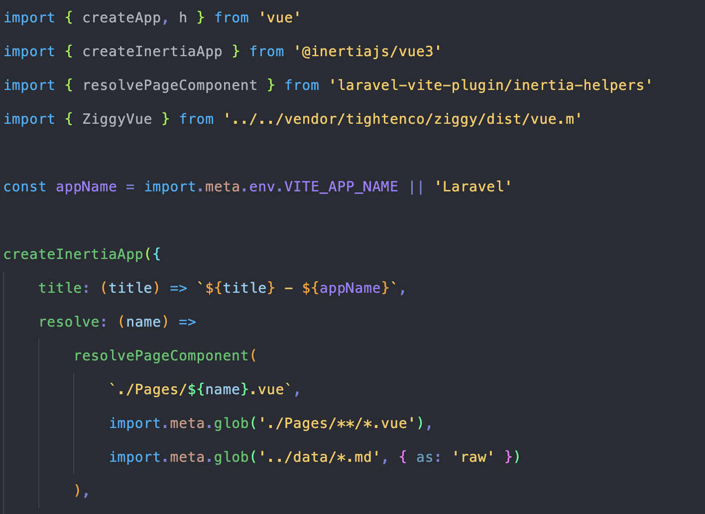
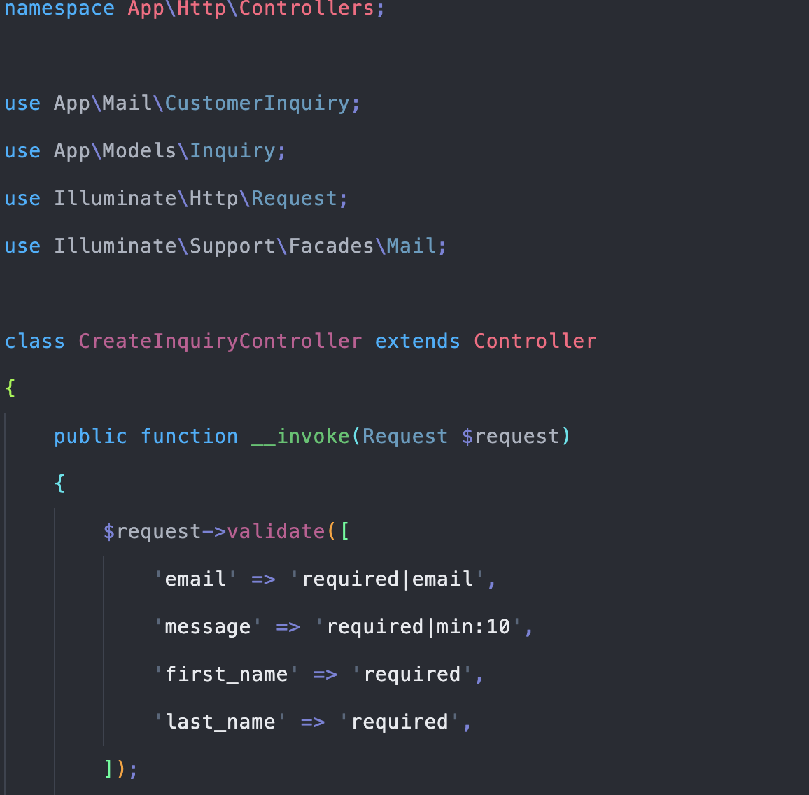
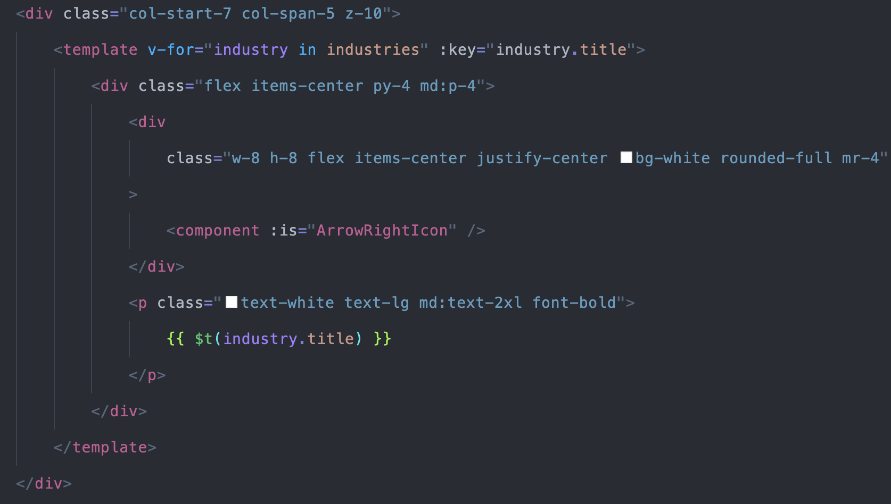

<!-- PROJECT LOGO -->
 

    

  <h3 align="center">Dark Theme</h3>

  

    An awesome Dark Theme for your VS Code!
  

### Required Themes

This section contains list of VS code extensions used in Theme.

* [![bearded-icons]][Next-url]
* [![Bluloco Dark]][React-url]

(<a href="#readme-top">back to top</a>)

<!-- GETTING STARTED -->
## Getting Started

<!-- USAGE EXAMPLES -->
## Usage

<!-- Use this space to show useful examples of how a project can be used. Additional screenshots, code examples and demos work well in this space. You may also link to more resources.

_For more examples, please refer to the [Documentation](https://example.com)_

(<a href="#readme-top">back to top</a>)
 -->
